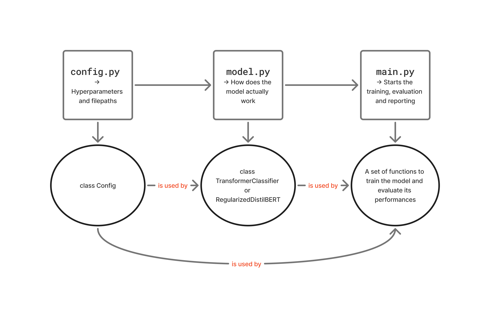

# NLP Final Project : classifier to differenciate between human-written economic texts and AI-generated ones


## Introduction 
**Authors : Tania ADMANE and Giovanni MANCHE** \
**Date** : July 2025 \
**Subject** : Final Project of the course "Introduction to NLP" at University Paris-Dauphine by Mr. Yair Lakretz


## Description 
The aim of this projet is to train an NLP classifier capable of distinguishing whether a given economic text (article, report, speech, etc.) originates from a real economic figure (such as the ECB, the FED, economist columns, or academic papers) or from an AI-generated source. To do so, we : 
- scrap data from several English and French sources (ECB press releases, columns, news), filtering to only get economic and financial subjects and clean it when necessary
- generate the same amount of texts via an AI-model,
- develop baseline classifier models to compare with the primary model,
- implement BERT-family models with classifier layer as our primary models  

## Project architecture and running
### Structure
```
NLP/
├── bias_study/
│   ├── plots/
│   ├── data_diagnostic.py        
├── BERT_model/  # contains the standard BERT used
│   ├── saved_models/
│   │   └── bert_classifier.pth    # To avoid training the model several times 
│   ├── config.py        
│   └── main.py
    └── model.py         
├── DistilBERT_models/  # contains the DistilBERT with and without troncature
│   ├── saved_models/
│   │   └── bert_classifier.pth    # To avoid training the model several times 
│   ├── config.py        
│   └── main.py
|   └── model.py
├── economic_articles/  # contains the webscraper and AI texts generator
│   ├── economic_articles_scraper.py  # webscraping of economic texts        
│   └── IA_generator.py
    └── process_dataset.py
├── Baseline_models/  # contains the svm, rf, lr models  
│   └── Baseline.py
    └── best_rf/svm/lr   # To avoid training the model several times 
```

### How to run 
#### Dependencies
Please make sure you have the required dependencies installed. To do so, simply run the following command in your environnement : 
```batch
pip install -r requirements.txt
```
#### Data scraping
One can scrap data from the web simply by running the file `economic_articles_scraper.py`. Adding url is possible and we automatically combine the new texts with the old database.

#### AI generator
Generating IA texts thanks to Groq API

#### Baseline_models
Contains the analysis of the 3 baseline models : SVM, random forest and Logistic Regression

#### BERT and DistilBERT 
Both are organized the same way : 
- in `config.py`, one can enter the different paths to its CSV files containing database, as well as model hyperparameters and the type of BERT one wants to use (uncased or not, base or distilled,...)
- in `model.py`, we define how does the model "work". The model's architecture is defined, as well as how to deal with data. 
- `main.py` is the file one should run to get results. It deals with the training and evaluation processes, returns evaluation metrics (accuracy, confusion matrix, F1-score,...). 

Please note that the file `DistilBERT_truncated.py` is independant and can be run separately.


## Conclusion 
For details on the code, the concepts used, and the conclusions, please refer to the report.

